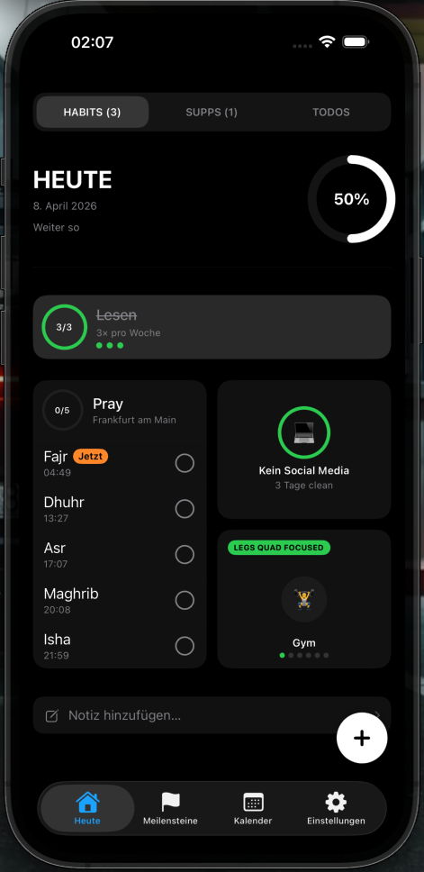

# Dialed Marketing Website -- Design Specification

Version 1.0 | 2026-04-08

This document is the single source of truth for implementing the Dialed marketing website. Every value is exact -- no guessing required.

---

## 1. Color Palette

All colors derived from the app's `Theme.swift` design tokens and the existing `index.html`.

| Token               | Hex / Value                          | Usage                                    |
|----------------------|--------------------------------------|------------------------------------------|
| `--bg`               | `#000000`                            | Page background                          |
| `--bg-subtle`        | `rgba(255, 255, 255, 0.02)`         | Alternating section background           |
| `--surface`          | `rgba(255, 255, 255, 0.06)`         | Cards, containers                        |
| `--surface-hover`    | `rgba(255, 255, 255, 0.09)`         | Card hover state                         |
| `--surface-active`   | `rgba(255, 255, 255, 0.12)`         | Card pressed state                       |
| `--surface-strong`   | `rgba(255, 255, 255, 0.15)`         | Elevated cards (hero stats, CTA area)    |
| `--text`             | `#F8FAFC`                            | Primary text (headings, body)            |
| `--text-secondary`   | `rgba(248, 250, 252, 0.60)`         | Subtitles, descriptions                  |
| `--text-tertiary`    | `rgba(248, 250, 252, 0.40)`         | Captions, metadata                       |
| `--text-muted`       | `rgba(248, 250, 252, 0.25)`         | Disabled text, faint labels              |
| `--accent`           | `#007AFF`                            | Links, interactive elements (iOS blue)   |
| `--accent-hover`     | `#339AFF`                            | Link hover state                         |
| `--success`          | `#34C759`                            | Streaks, completion, check marks         |
| `--success-dim`      | `rgba(52, 199, 89, 0.15)`           | Success background tint                  |
| `--border`           | `rgba(255, 255, 255, 0.08)`         | Card borders, dividers                   |
| `--border-subtle`    | `rgba(255, 255, 255, 0.04)`         | Faint separators                         |
| `--gradient-hero`    | `linear-gradient(180deg, rgba(255,255,255,0.04) 0%, transparent 100%)` | Hero section subtle top glow |
| `--gradient-card`    | `linear-gradient(135deg, rgba(255,255,255,0.06) 0%, rgba(255,255,255,0.02) 100%)` | Premium card fill |
| `--gradient-cta`     | `linear-gradient(135deg, #F8FAFC 0%, #E2E8F0 100%)` | CTA button fill (white-ish) |
| `--ring-green`       | `conic-gradient(#34C759 var(--pct), rgba(255,255,255,0.08) 0)` | Progress ring (used in mockup) |

### CSS Custom Properties Block

```css
:root {
  --bg: #000000;
  --bg-subtle: rgba(255, 255, 255, 0.02);
  --surface: rgba(255, 255, 255, 0.06);
  --surface-hover: rgba(255, 255, 255, 0.09);
  --surface-active: rgba(255, 255, 255, 0.12);
  --surface-strong: rgba(255, 255, 255, 0.15);
  --text: #F8FAFC;
  --text-secondary: rgba(248, 250, 252, 0.60);
  --text-tertiary: rgba(248, 250, 252, 0.40);
  --text-muted: rgba(248, 250, 252, 0.25);
  --accent: #007AFF;
  --accent-hover: #339AFF;
  --success: #34C759;
  --success-dim: rgba(52, 199, 89, 0.15);
  --border: rgba(255, 255, 255, 0.08);
  --border-subtle: rgba(255, 255, 255, 0.04);
}
```

---

## 2. Typography

### Font Stack

```css
font-family: -apple-system, BlinkMacSystemFont, 'SF Pro Display', 'SF Pro Text', 'Helvetica Neue', Arial, sans-serif;
```

This resolves to SF Pro on Apple devices and falls back cleanly on others. No web font loading required.

### Type Scale

| Element       | Size    | Weight | Line Height | Letter Spacing | Tag / Class      |
|---------------|---------|--------|-------------|----------------|------------------|
| Hero Title    | 48px    | 800    | 1.1         | -1.5px         | `h1`             |
| Section Title | 32px    | 700    | 1.2         | -0.5px         | `h2`             |
| Card Title    | 20px    | 600    | 1.3         | -0.2px         | `h3`             |
| Body          | 16px    | 400    | 1.6         | 0              | `p`              |
| Body Small    | 15px    | 400    | 1.5         | 0              | `.body-sm`       |
| Caption       | 13px    | 500    | 1.4         | 0.2px          | `.caption`       |
| Overline      | 11px    | 700    | 1.2         | 1.5px          | `.overline`      |
| CTA Button    | 17px    | 600    | 1.0         | -0.2px         | `.cta`           |
| Nav Link      | 14px    | 500    | 1.0         | 0              | `.nav-link`      |

### Mobile Adjustments

| Element       | Mobile Size | Breakpoint |
|---------------|-------------|------------|
| Hero Title    | 36px        | < 640px    |
| Section Title | 24px        | < 640px    |
| Body          | 15px        | < 640px    |

### Overline Style (used for section labels like "FEATURES", "PRIVACY")

```css
.overline {
  font-size: 11px;
  font-weight: 700;
  letter-spacing: 1.5px;
  text-transform: uppercase;
  color: var(--text-tertiary);
}
```

---

## 3. Layout Grid

### Container

```css
.container {
  max-width: 1080px;
  margin: 0 auto;
  padding: 0 24px;
}
```

### Breakpoints

| Name     | Min Width | Columns | Gutter | Container Padding |
|----------|-----------|---------|--------|--------------------|
| Mobile   | 0px       | 1       | 16px   | 20px               |
| Tablet   | 640px     | 2       | 20px   | 24px               |
| Desktop  | 1024px    | 3       | 24px   | 24px               |

```css
@media (min-width: 640px)  { /* tablet  */ }
@media (min-width: 1024px) { /* desktop */ }
```

### Section Spacing

| Between          | Desktop  | Mobile  |
|------------------|----------|---------|
| Sections         | 120px    | 80px    |
| Section to heading | 0      | 0       |
| Heading to content | 48px   | 32px    |
| Cards (gap)      | 20px     | 16px    |

### Section Wrapper

```css
.section {
  padding: 120px 0;
}

@media (max-width: 639px) {
  .section {
    padding: 80px 0;
  }
}
```

---

## 4. Component Specs

### 4.1 Hero Section

**Layout:** Vertically centered content, horizontally centered within container. Full viewport height on desktop (100vh), auto height on mobile.

```
[  Overline: "SUPPLEMENTS. HABITS. TODOS."  ]
[            App Icon (96x96)               ]
[          "Dialed" -- h1, 48px             ]
[   Subtitle -- 18px, text-secondary        ]
[   Description -- 16px, text-secondary      ]
[         [ Download on App Store ]          ]
[                                            ]
[       iPhone Mockup (centered)             ]
```

**App Icon:**

```css
.hero-icon {
  width: 96px;
  height: 96px;
  border-radius: 22px;              /* matches iOS icon radius */
  background: var(--surface);
  display: flex;
  align-items: center;
  justify-content: center;
  margin: 0 auto 24px;
  font-size: 48px;                  /* emoji fallback */
}
```

If the actual app icon PNG is available, use an `` tag inside the container. Otherwise, use the pill emoji as in the current site.

**CTA Button (App Store badge):**

```css
.cta-badge {
  display: inline-block;
  margin-top: 32px;
}

.cta-badge img {
  height: 54px;                     /* Apple's recommended minimum */
  transition: opacity 0.2s ease;
}

.cta-badge:hover img {
  opacity: 0.85;
}
```

If the App Store link is not yet live, show a styled fallback button:

```css
.cta-button {
  display: inline-flex;
  align-items: center;
  gap: 8px;
  padding: 14px 28px;
  background: var(--text);           /* white button on dark bg */
  color: #000000;
  font-size: 17px;
  font-weight: 600;
  letter-spacing: -0.2px;
  border: none;
  border-radius: 14px;
  cursor: pointer;
  transition: transform 0.2s ease, opacity 0.2s ease;
}

.cta-button:hover {
  transform: scale(1.02);
  opacity: 0.92;
}

.cta-button:active {
  transform: scale(0.98);
}
```

**Hero Spacing:**

- Top padding: 80px (mobile: 60px)
- Icon to title: 24px
- Title to subtitle: 8px
- Subtitle to description: 16px
- Description to CTA: 32px
- CTA to mockup: 64px (mobile: 48px)
- Bottom padding: 0 (flows into next section)

### 4.2 Feature Cards

**Layout:** 3-column grid on desktop, 2-column on tablet, 1-column stacked on mobile.

```css
.features-grid {
  display: grid;
  grid-template-columns: repeat(3, 1fr);
  gap: 20px;
}

@media (max-width: 1023px) {
  .features-grid {
    grid-template-columns: repeat(2, 1fr);
  }
}

@media (max-width: 639px) {
  .features-grid {
    grid-template-columns: 1fr;
    gap: 16px;
  }
}
```

**Individual Card:**

```css
.feature-card {
  padding: 28px;
  background: var(--surface);
  border: 1px solid var(--border);
  border-radius: 16px;
  transition: background 0.25s ease, border-color 0.25s ease, transform 0.25s ease;
}

.feature-card:hover {
  background: var(--surface-hover);
  border-color: rgba(255, 255, 255, 0.12);
  transform: translateY(-2px);
}
```

**Card Interior:**

```
[ Icon -- 36x36, rounded 10px bg, centered emoji/SF Symbol ]
[ 12px gap ]
[ Title -- h3, 20px, weight 600 ]
[ 8px gap ]
[ Description -- 15px, text-secondary, line-height 1.5 ]
```

**Feature Icon Container:**

```css
.feature-icon {
  width: 44px;
  height: 44px;
  border-radius: 12px;
  background: var(--surface-active);
  display: flex;
  align-items: center;
  justify-content: center;
  font-size: 22px;
  margin-bottom: 16px;
}
```

**Feature List (6 cards):**

| Icon | Title              | Description                                                        |
|------|--------------------|--------------------------------------------------------------------|
| pill.circle.fill     | Supplements        | Create intake schedules with reminders. Track daily intake with a single tap. |
| checkmark.circle.fill | Habits             | Daily, weekly, and plan habits. Abstinence tracking. Progress rings.  |
| checklist            | Todos              | Task list with labels, notes, and location-based reminders.          |
| moon.stars.fill      | Prayer Times       | Automatic calculation based on your location. Integrated into your daily flow. |
| trophy.fill          | Milestones         | Streak system from 7 to 365 days. Visual progress for every habit.   |
| lock.shield.fill     | Privacy First      | No servers. No analytics. No account. All data stays on your device. |

Use SF Symbols via emoji approximations or inline SVG. For the simplest approach, use emoji characters that map closely: pill, checkmark, clipboard, crescent moon, trophy, lock.

### 4.3 Trust Badges Section

**Purpose:** Reinforce privacy and quality signals. Placed between features and footer.

**Layout:** Horizontal row on desktop (centered, flex), 2x2 grid on mobile.

```css
.trust-badges {
  display: flex;
  justify-content: center;
  gap: 48px;
  flex-wrap: wrap;
}

@media (max-width: 639px) {
  .trust-badges {
    gap: 24px;
    justify-content: center;
  }
}
```

**Individual Badge:**

```css
.trust-badge {
  text-align: center;
  min-width: 120px;
}

.trust-badge-icon {
  font-size: 28px;
  margin-bottom: 8px;
  color: var(--text-tertiary);
}

.trust-badge-label {
  font-size: 13px;
  font-weight: 600;
  color: var(--text-secondary);
  letter-spacing: 0.2px;
}
```

**Badge List (4 items):**

| Icon               | Label              |
|--------------------|--------------------|
| lock (shield)      | 100% Offline       |
| eye (slash)        | No Tracking        |
| icloud (slash)     | No Account         |
| arrow.down.doc     | Backup & Restore   |

### 4.4 Footer

**Layout:** Centered, simple. Matches the current site's `privacy` section but elevated.

```css
footer {
  padding: 48px 0;
  border-top: 1px solid var(--border);
  text-align: center;
}

footer p {
  font-size: 13px;
  color: var(--text-tertiary);
  margin-bottom: 8px;
}

footer a {
  color: var(--text-secondary);
  text-decoration: none;
  transition: color 0.2s ease;
}

footer a:hover {
  color: var(--text);
  text-decoration: underline;
}
```

**Footer Content:**

```
[ Privacy Policy ]  |  [ Contact ]
(c) 2026 Serdar Saglam
```

**Link separator:** Use a vertical bar `|` with `0 12px` margin, colored `var(--text-muted)`.

---

## 5. Animations

### 5.1 Scroll-Triggered Entrance (Intersection Observer)

Every `.section` and `.feature-card` fades in and slides up on scroll.

**Initial state (CSS):**

```css
.fade-in {
  opacity: 0;
  transform: translateY(24px);
  transition: opacity 0.6s ease, transform 0.6s ease;
}

.fade-in.visible {
  opacity: 1;
  transform: translateY(0);
}
```

**JavaScript (vanilla, no dependencies):**

```js
const observer = new IntersectionObserver((entries) => {
  entries.forEach(entry => {
    if (entry.isIntersecting) {
      entry.target.classList.add('visible');
    }
  });
}, { threshold: 0.1, rootMargin: '0px 0px -40px 0px' });

document.querySelectorAll('.fade-in').forEach(el => observer.observe(el));
```

**Stagger for feature cards:** Add `transition-delay` via inline style or nth-child:

```css
.feature-card:nth-child(1) { transition-delay: 0ms; }
.feature-card:nth-child(2) { transition-delay: 80ms; }
.feature-card:nth-child(3) { transition-delay: 160ms; }
.feature-card:nth-child(4) { transition-delay: 240ms; }
.feature-card:nth-child(5) { transition-delay: 320ms; }
.feature-card:nth-child(6) { transition-delay: 400ms; }
```

### 5.2 Hover Transitions

All interactive elements use `transition: all 0.25s ease`. Specific overrides:

| Element       | Property          | Duration | Easing    |
|---------------|-------------------|----------|-----------|
| Feature card  | background, border, transform | 0.25s | ease |
| CTA button    | transform, opacity | 0.2s    | ease      |
| Footer links  | color              | 0.2s    | ease      |
| Trust badges  | opacity            | 0.2s    | ease      |

### 5.3 Hero Animation

The hero section animates on page load (no scroll trigger needed):

```css
.hero-content {
  animation: heroFadeIn 0.8s ease forwards;
}

@keyframes heroFadeIn {
  from {
    opacity: 0;
    transform: translateY(20px);
  }
  to {
    opacity: 1;
    transform: translateY(0);
  }
}
```

The iPhone mockup slides up slightly later:

```css
.hero-mockup {
  animation: heroFadeIn 0.8s ease 0.3s forwards;
  opacity: 0;  /* start hidden, animation fills forward */
}
```

### 5.4 Reduced Motion

```css
@media (prefers-reduced-motion: reduce) {
  *, *::before, *::after {
    animation-duration: 0.01ms !important;
    animation-iteration-count: 1 !important;
    transition-duration: 0.01ms !important;
  }

  .fade-in {
    opacity: 1;
    transform: none;
  }
}
```

---

## 6. Mobile Considerations

### Stacking Behavior

| Component       | Desktop            | Tablet             | Mobile (< 640px)       |
|-----------------|--------------------|--------------------|------------------------|
| Feature grid    | 3 columns          | 2 columns          | 1 column, stacked      |
| Trust badges    | Horizontal row     | Horizontal row     | 2x2 centered grid      |
| Hero            | Centered, spacious | Centered, spacious | Tighter padding        |
| iPhone mockup   | 320px wide         | 280px wide         | 240px wide             |
| Footer links    | Inline with `|`    | Inline with `|`    | Stacked vertically     |

### Touch Targets

All interactive elements must be at least 44x44px (Apple HIG minimum). This applies to:

- CTA button: 54px height minimum (already exceeds)
- Footer links: wrap in padding to achieve 44px tap area
- Any future nav links

```css
footer a {
  display: inline-block;
  padding: 12px 16px;  /* creates ~44px touch target */
  margin: -12px -16px;  /* negative margin keeps visual alignment */
}
```

### Font Scaling

Respect user font size preferences. Use `rem` or `px` with this base:

```css
html {
  font-size: 16px;
  -webkit-text-size-adjust: 100%;
}
```

On mobile (< 640px), the hero title and section titles use smaller fixed sizes (see Typography section) rather than fluid scaling. This prevents overflow on small screens.

### Safe Areas

```css
body {
  padding-left: env(safe-area-inset-left);
  padding-right: env(safe-area-inset-right);
  padding-bottom: env(safe-area-inset-bottom);
}
```

### No Horizontal Scroll

```css
html, body {
  overflow-x: hidden;
}
```

---

## 7. iPhone Mockup (CSS-Only Phone Frame)

Present app screenshots inside a CSS-drawn iPhone frame. No image dependencies for the frame itself -- only the screenshot content image.

### Frame Structure

```html
<div class="phone-frame">
  <div class="phone-notch"></div>
  <div class="phone-screen">
    
  </div>
</div>
```

### Frame CSS

```css
.phone-frame {
  position: relative;
  width: 280px;
  aspect-ratio: 9 / 19.5;
  background: #1C1C1E;              /* iOS dark frame color */
  border-radius: 44px;
  padding: 12px;
  box-shadow:
    0 0 0 2px rgba(255, 255, 255, 0.08),   /* subtle rim */
    0 25px 60px rgba(0, 0, 0, 0.5);         /* drop shadow */
  margin: 0 auto;
}

.phone-notch {
  position: absolute;
  top: 12px;
  left: 50%;
  transform: translateX(-50%);
  width: 120px;
  height: 32px;
  background: #000000;
  border-radius: 0 0 20px 20px;
  z-index: 2;
}

.phone-screen {
  width: 100%;
  height: 100%;
  border-radius: 34px;
  overflow: hidden;
  background: #000000;
}

.phone-screen img {
  width: 100%;
  height: 100%;
  object-fit: cover;
  object-position: top;
}
```

### Responsive Sizing

```css
.phone-frame {
  width: 320px;
}

@media (max-width: 1023px) {
  .phone-frame {
    width: 280px;
  }
}

@media (max-width: 639px) {
  .phone-frame {
    width: 240px;
  }
}
```

### Dynamic Island Variant (for newer iPhone look)

Replace the notch with a Dynamic Island pill:

```css
.phone-notch {
  width: 100px;
  height: 28px;
  border-radius: 14px;
  top: 16px;
}
```

### Screenshot Sources

Use the existing App Store screenshots from `docs/appstore/screens/`:

| Priority | File                | Description      |
|----------|---------------------|------------------|
| 1 (hero) | `1-today.png`      | Today view       |
| 2        | `3-supps.png`      | Supplements list |
| 3        | `5-milestones.png` | Milestones       |

Only the hero screenshot is shown by default. The others can be used in an optional scrollable gallery or feature sections if needed later.

---

## 8. Accessibility

### Contrast Ratios (WCAG 2.1 AA Compliance)

| Foreground          | Background  | Ratio  | Pass? |
|---------------------|-------------|--------|-------|
| `#F8FAFC` on `#000` | --         | 19.7:1 | AAA   |
| `rgba(248,250,252,0.60)` on `#000` | -- | ~11:1 | AAA |
| `rgba(248,250,252,0.40)` on `#000` | -- | ~7:1  | AA   |
| `rgba(248,250,252,0.25)` on `#000` | -- | ~4.5:1 | AA (barely) |
| `#34C759` on `#000` | --          | 6.4:1  | AA   |
| `#007AFF` on `#000` | --          | 4.7:1  | AA   |
| `#000` on `#F8FAFC` (CTA button) | -- | 19.7:1 | AAA |

The `--text-muted` value at 0.25 opacity is only used for decorative elements (copyright year, separators), never for informational text.

### Focus States

```css
:focus-visible {
  outline: 2px solid var(--accent);
  outline-offset: 3px;
  border-radius: 4px;
}

/* Remove default outline when not using keyboard */
:focus:not(:focus-visible) {
  outline: none;
}
```

### Screen Reader Support

- All images require descriptive `alt` text
- The phone mockup should have `role="img"` and `aria-label="Screenshot of the Dialed app showing the Today view"`
- Use semantic HTML: `<header>`, `<main>`, `<section>`, `<footer>`
- Section headings should follow logical order: one `<h1>`, then `<h2>` per section
- The CTA link should have `aria-label="Download Dialed on the App Store"`

### Reduced Motion

Already covered in Section 5.4. All animations and transitions are disabled when `prefers-reduced-motion: reduce` is active.

### Color Independence

No information is conveyed by color alone. The success green is always paired with a label or icon.

---

## 9. Visual Hierarchy (Eye Flow)

The page is designed as a single vertical scroll. The user's eye should follow this path:

### First 2 seconds (above the fold)

1. **Hero title "Dialed"** -- largest element, 48px, weight 800. Immediate brand recognition.
2. **Subtitle** -- "Supplement & Habit Tracker" explains what the app does.
3. **CTA button / App Store badge** -- the primary action. White on black for maximum contrast.

### Next 3 seconds (scrolling begins)

4. **iPhone mockup** -- visual proof. The user sees the actual app UI. Establishes credibility.
5. **Overline "FEATURES"** -- small, uppercase, signals a new section.
6. **Feature cards** -- scan the grid. Icons draw the eye first, then titles, then descriptions.

### Deeper scroll (10+ seconds)

7. **Trust badges** -- reinforce privacy and offline messaging. Quick visual scan.
8. **Footer** -- privacy policy link, contact, copyright.

### Design Principles for Hierarchy

- **Size contrast:** Hero title (48px) vs body (16px) = 3:1 ratio. This is the primary hierarchy driver.
- **Weight contrast:** 800 for hero, 700 for sections, 600 for cards, 400 for body.
- **Opacity contrast:** Primary text at 100%, secondary at 60%, tertiary at 40%. Three clear tiers.
- **Spacing as separation:** 120px between sections creates clear breathing room. Each section is its own "room."
- **Single focal point per section:** Hero = title + CTA. Features = the grid. Trust = the badge row. No section competes with another.

---

## 10. Page Structure Summary

```
+--------------------------------------------------+
|                   HERO SECTION                    |
|     Overline > Icon > Title > Subtitle > CTA     |
|              iPhone Mockup (centered)             |
+--------------------------------------------------+
|                                                    |
|                FEATURES SECTION                   |
|     Overline "FEATURES" > 6-card grid             |
|                                                    |
+--------------------------------------------------+
|                                                    |
|              TRUST BADGES SECTION                 |
|     4 badges in a row (offline, no tracking,      |
|     no account, backup)                           |
|                                                    |
+--------------------------------------------------+
|                    FOOTER                         |
|     Privacy Policy | Contact                      |
|     (c) 2026 Serdar Saglam                        |
+--------------------------------------------------+
```

### Section Count: 4

The page is intentionally short. Every section earns its place. No filler content, no testimonial sections (no users yet), no pricing (free app). This can expand later.

---

## 11. Implementation Notes

### File Structure

```
docs/website/
  index.html          -- single HTML file with embedded CSS and JS
  privacy.html        -- privacy policy (already exists)
  screens/            -- symlink or copy of docs/appstore/screens/
```

### No Build Tools

- No bundler, no preprocessor, no framework
- All CSS is in a single `<style>` tag in `index.html`
- All JS is in a single `<script>` tag at the bottom of `<body>`
- Total page weight target: under 200KB (excluding screenshot images)

### Image Optimization

- Screenshot PNGs should be compressed (tinypng or similar) before deployment
- Use `loading="lazy"` on all images except the hero screenshot
- Consider providing WebP versions with `<picture>` fallback

### Meta Tags

```html
<meta charset="UTF-8">
<meta name="viewport" content="width=device-width, initial-scale=1.0">
<meta name="description" content="Dialed -- your all-in-one tracker for supplements, habits, and todos. Fully offline. No account required.">
<meta name="theme-color" content="#000000">
<meta property="og:title" content="Dialed -- Supplement & Habit Tracker">
<meta property="og:description" content="Track supplements, habits, and todos. Offline, private, no account needed.">
<meta property="og:type" content="website">
<link rel="icon" type="image/png" href="favicon.png">
```

### Performance Budget

| Metric          | Target    |
|-----------------|-----------|
| First paint     | < 0.5s    |
| Total page size | < 200KB   |
| JS size         | < 2KB     |
| CSS size        | < 8KB     |
| Lighthouse perf | > 95      |
